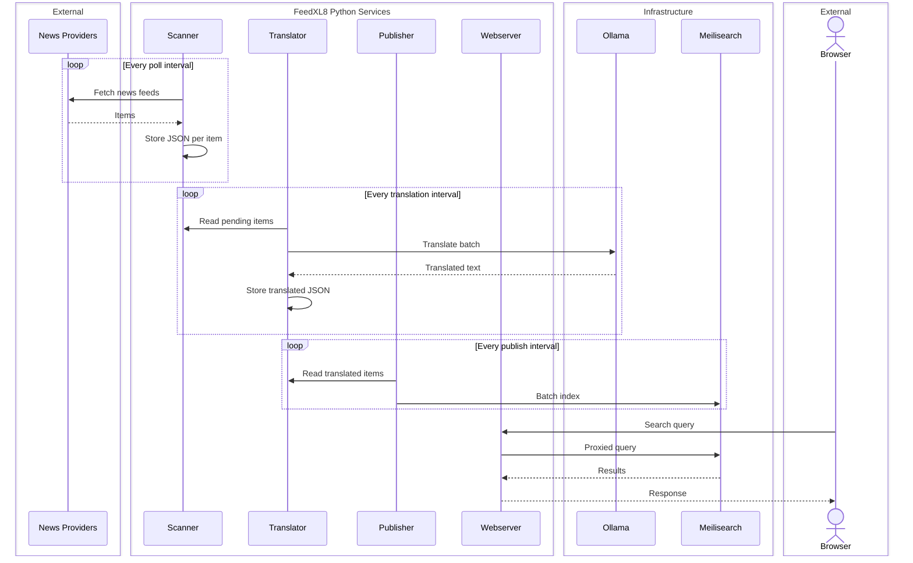

> **This project is under active development. Configuration formats, APIs, and data structures may change without notice. No stability or backwards-compatibility guarantees are made.**

# FeedXL8

FeedXL8 collects RSS feeds from configurable news sources, translates their content into a target language using a locally running AI model via [Ollama](https://ollama.com), indexes the results in [Meilisearch](https://www.meilisearch.com) for fast full-text search, and serves everything through a lightweight web frontend — entirely on your own infrastructure, with no dependency on external cloud services.

## Architecture



## Components

| Service | File | Role |
|---|---|---|
| Scanner | `feedxl8_scanner.py` | Polls RSS feeds on a configurable interval and stores raw items as JSON |
| Translator | `feedxl8_translator.py` | Batches items and sends them to Ollama for AI translation |
| Publisher | `feedxl8_publisher.py` | Pushes translated items into the Meilisearch index |
| Webserver | `feedxl8_webserver.py` | Serves the frontend and proxies Meilisearch queries (API key never exposed to the browser) |

## Prerequisites

- Python 3.10+
- [Ollama](https://ollama.com) with a translation-capable model pulled (e.g. `translategemma`)
- Meilisearch — see [meilisearch-howto.md](meilisearch-howto.md) for a bare-metal setup guide

## Installation

```sh
git clone https://github.com/KoRElibs/feedxl8.git
cd feedxl8
pip install -r requirements.txt
cp feedxl8.conf.example feedxl8.conf
```

Edit `feedxl8.conf` to configure your feed sources, target language, Ollama model, and Meilisearch connection.

## Running

Each component is an independent process. For development, run them directly:

```sh
python feedxl8_scanner.py
python feedxl8_translator.py
python feedxl8_publisher.py
python feedxl8_webserver.py
```

For production, systemd unit files are provided in the [`systemd/`](systemd/) directory.

## Configuration

Copy `feedxl8.conf.example` to `feedxl8.conf`. Feed sources are defined as INI sections:

```ini
[spiegel.de]
url           = https://www.spiegel.de/international/index.rss
country       = DE
language      = English
language_code = en-GB
```

See `feedxl8.conf.example` for all available settings including scan intervals, retention, Ollama model, translation batching, and TLS configuration.

## License

Licensed under the [European Union Public Licence v1.2 (EUPL-1.2)](LICENSE).
Copyright © 2026 KoRElibs.com
