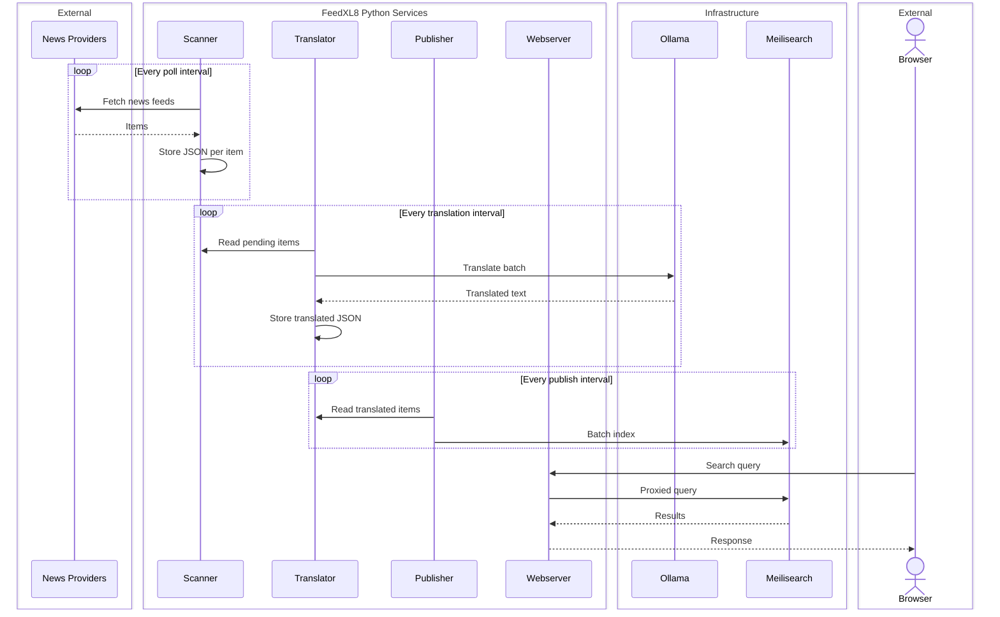
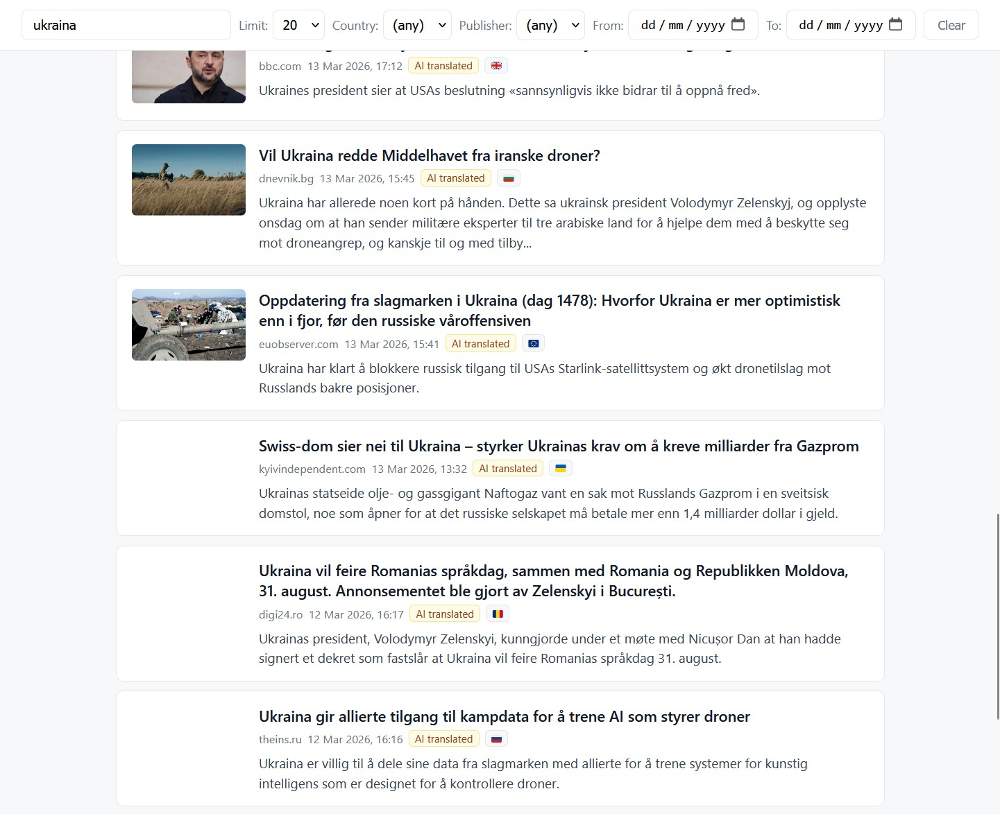

> **This project is under active development. Configuration formats, APIs, and data structures may change without notice. No stability or backwards-compatibility guarantees are made.**

# FeedXL8

FeedXL8 collects RSS feeds from configurable news sources, translates their content into a target language using a locally running AI model via [Ollama](https://ollama.com), indexes the results in [Meilisearch](https://www.meilisearch.com) for fast full-text search, and serves everything through a lightweight web frontend — entirely on your own infrastructure, with no dependency on external cloud services.

## Architecture



## Components

| Service | File | Role |
|---|---|---|
| Scanner | `feedxl8_scanner.py` | Polls RSS feeds on a configurable interval and stores raw items as JSON |
| Translator | `feedxl8_translator.py` | Batches items and sends them to Ollama for AI translation |
| Publisher | `feedxl8_publisher.py` | Pushes translated items into the Meilisearch index |
| Webserver | `feedxl8_webserver.py` | Serves the frontend and proxies Meilisearch queries (API key never exposed to the browser) |



## Prerequisites

- Python 3.10+
- [Ollama](https://ollama.com) with a translation-capable model pulled (e.g. `translategemma`)
- Meilisearch — see [meilisearch-howto.md](meilisearch-howto.md) for a bare-metal setup guide
- Python packages: `feedparser`, `requests`, `Pillow` — installed via `pip install -r requirements.txt`. On Linux, Pillow requires system libraries; install them first with `apt install libjpeg-dev zlib1g-dev` (Debian/Ubuntu) or the equivalent for your distribution.

## Installation

```sh
git clone https://github.com/KoRElibs/feedxl8.git
cd feedxl8
pip install -r requirements.txt
cp feedxl8.conf.example feedxl8.conf
```

Edit `feedxl8.conf` to configure your feed sources, target language, Ollama model, and Meilisearch connection.

## Running

Each component is an independent process. For development, run them directly:

```sh
python feedxl8_scanner.py
python feedxl8_translator.py
python feedxl8_publisher.py
python feedxl8_webserver.py
```

For production, systemd unit files are provided in the [`systemd/`](systemd/) directory.

## Configuration

All configuration lives in `feedxl8.conf` (copied from `feedxl8.conf.example` during installation).

### Ollama

Point FeedXL8 at your Ollama instance and choose a translation-capable model:

```ini
ollama_url   = http://localhost:11434
ollama_model = translategemma
```

The model must already be pulled on the Ollama server (`ollama pull translategemma`). The translator will fail silently on every batch until this is correct.

### Meilisearch

Provide the URL and an API key with write access:

```ini
meili_url     = http://localhost:7700
meili_api_key = your-master-or-write-key
meili_index   = news
```

See [meilisearch-howto.md](meilisearch-howto.md) for a bare-metal setup guide including index creation and API key configuration.

### Target language

Set the language all content will be translated into:

```ini
target_language      = Norwegian
target_language_code = nb-NO
```

> Only one target language is supported at a time.

### Feed sources

Each RSS feed is an INI section. The section name becomes the publisher identifier in the search index:

```ini
[spiegel.de]
url           = https://www.spiegel.de/international/index.rss
country       = DE
language      = English
language_code = en-GB
```

`feedxl8.conf.example` includes example feed sources with a focus on European news outlets.

### Country flags

Each article is tagged with the flag of its source country. Flags are rendered using Unicode emoji — the two-letter country code (e.g. `NO`) is converted to a pair of Unicode Regional Indicator characters that modern operating systems and browsers combine into a flag glyph. No fonts, no CDN, no external requests of any kind.

This works natively on macOS, iOS, Android, Linux, and Windows 11 with a Chromium-based browser. On older Windows versions flags may render as two plain letters rather than a glyph — the country code is always available as a tooltip on hover regardless.

If you need consistent SVG flag rendering across all platforms, [flag-icons](https://github.com/lipis/flag-icons) is a self-hostable alternative: download the package, serve the `css/` and `flags/` directories as static files alongside `index.html`, add a `<link>` to the local CSS, and replace the `toFlag()` call in `index.html` with a `<span class="fi fi-xx">` element using the lowercased country code.

### Image proxy

The webserver proxies all article images through `/imgproxy` rather than serving them directly from their source URLs. Every image is fully decoded to raw pixels and re-encoded as a fresh JPEG before being cached and served — stripping all EXIF data, ICC profiles, and embedded metadata. This eliminates image-based exploit payloads, prevents the browser from leaking the user's IP to third-party image hosts, and reduces bandwidth by resizing images to a configurable maximum resolution.

### Other settings

`feedxl8.conf.example` documents all remaining options: scan and publish intervals, file retention, translation batch sizes, webserver host/port, and TLS configuration.

## License

Licensed under the [European Union Public Licence v1.2 (EUPL-1.2)](LICENSE).
Copyright © 2026 KoRElibs.com

The EUPL is an open source licence created by the European Commission and legally reviewed for all EU jurisdictions. It is less widely known than MIT or Apache, but it is straightforward to understand in practice:

- **Running FeedXL8 — including commercially — carries no obligations.** Use it on your own infrastructure however you like.
- **It is not viral.** Linking your own code against FeedXL8, or building a larger system that calls it, does not pull your code under the EUPL. Components remain independently licensed.
- **Copyleft applies only if you distribute a modified version of FeedXL8 itself.** In that case, your modifications must be released under the EUPL — but only those modifications, not your surrounding systems.
In short: use it freely, build on top of it freely, and only share back if you ship a modified FeedXL8 to others.
